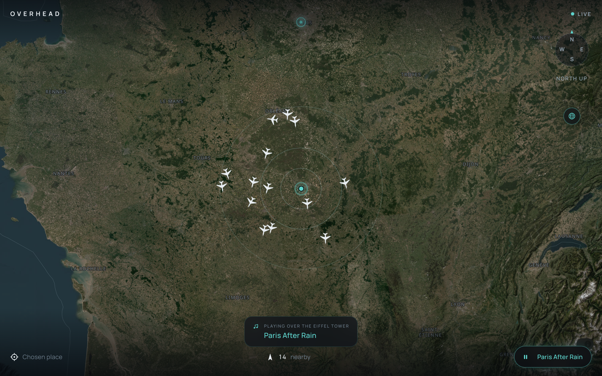
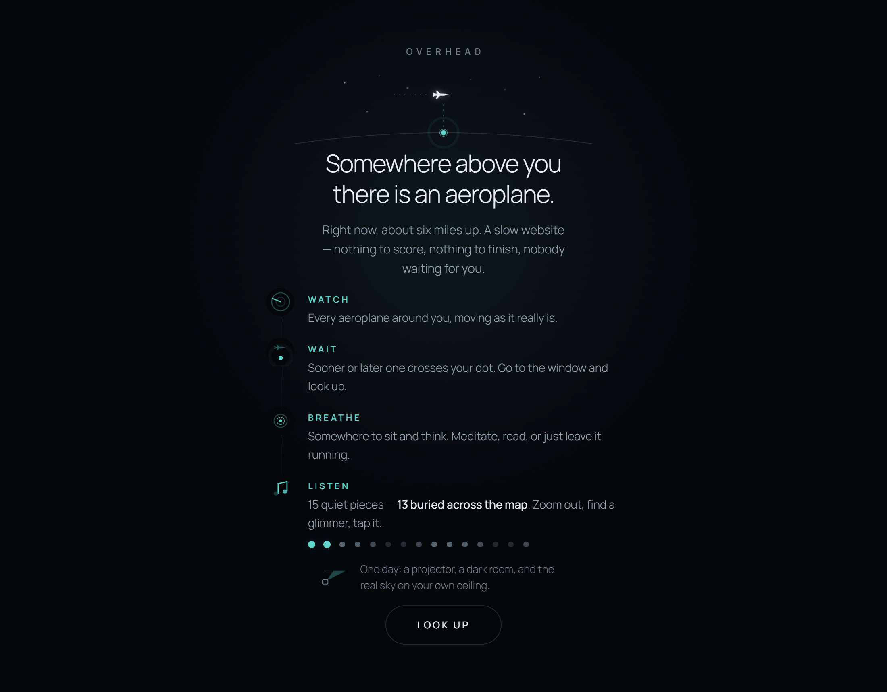
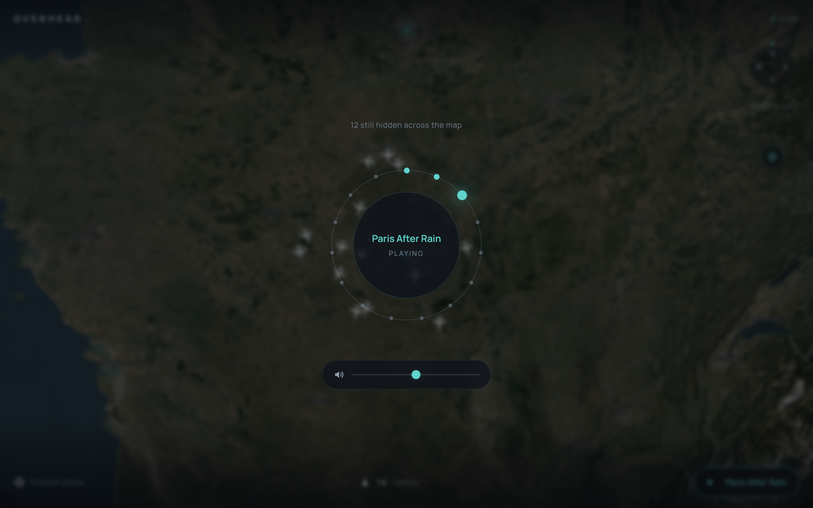

# ✈️ OVERHEAD

A quiet little place to watch the sky, listen to music, study, relax, and just chill.

---

<p align="center">
  
  
  
</p>

<br>
---

## ✨ Features

<div align="center">


</div>


## 🌌 What is OVERHEAD?

Somewhere above you, there is probably an aeroplane.

**OVERHEAD lets you see it. ✈️**

Open the app, choose your location, and discover the aircraft flying above and around you in real time. See where they are, where they're heading, how high they are, and watch them move across the sky.

But OVERHEAD is more than just a live aircraft map.

**Key features:**

- 🌤️ **Switch between day and night** — Explore the sky on a clean daytime map, or turn on **Night Flight** for a darker, atmospheric view with city lights, roads and runways glowing beneath you.
- 🧭 **Rotate the world around you** — Move, zoom and rotate the map, follow the compass, and explore the sky from whichever direction you want.
- 🎧 **Listen while you watch** — OVERHEAD includes ambient music designed for different moods — from calm sounds for studying or working to atmospheric tracks for late-night sky watching.
- ✨ **Discover hidden places** — Some locations around the world hide special ambient experiences. Explore the map, find them, and unlock new sounds as you travel.
- 🌍 **Search anywhere** — You don't have to be where you are. Search for a city or place and see what the sky looks like there.

You can leave OVERHEAD open while studying, working, relaxing, listening to music, or simply wondering what's flying above you.

And when an aircraft gets close to your position...

**Look up. ✈️**

---

## ✨ Features

| Feature | Description |
|---------|-----------|
| ✈️ **Live aircraft** | See nearby aircraft and watch them move across the map |
| 📍 **Your location** | Start from your real location or choose somewhere manually |
| 🧭 **Real compass** | Use your device orientation to find north |
| 🗺️ **Rotatable map** | Pan, zoom and rotate the world naturally |
| 🌍 **Globe view** | Zoom out and explore the planet |
| 🌙 **Night Flight** | A dark world of cities, roads and lights |
| 🎧 **Ambient audio** | Calm sounds for studying, relaxing or simply chilling |
| 🌍 **Hidden places** | Discover ambient tracks hidden around the world |
| 💾 **Local memory** | Remember selected locations and discoveries on your device |
| ⚡ **Lightweight** | No accounts, analytics, database or unnecessary backend |

---

## 🛰️ Live sky

Aircraft data comes from the **OpenSky Network**.

OVERHEAD requests a small area around your location and displays the aircraft currently visible there.

The architecture is simple:

```
🛰️ OpenSky
    ↓
📡 Aircraft data
    ↓
✈️ OVERHEAD
    ↓
🌌 Your sky
```

Aircraft positions are refreshed approximately every **15 seconds**.

Instead of jumping between positions, aircraft are smoothly interpolated between updates so they feel like they're actually flying across the map.

---

## 🗺️ Explore the world

The map isn't just something sitting underneath the aircraft. You can interact with it in several ways:

| Action | Control |
|--------|---------|
| 🖐️ Pan | Drag |
| 🔍 Zoom | Scroll / Pinch |
| 🔄 Rotate | Two fingers / Right-drag |
| 🧭 North | Compass |

The map can be rotated freely. When you've turned away from north, a small **N** appears beside the compass so you always know your orientation.

If your device provides a real heading, tapping the compass can hand control of the map over to your device.

### Three different directions

OVERHEAD intentionally keeps these separate:

- 🗺️ **Map bearing** — which way the map is rotated
- ✈️ **Aircraft heading** — which way an aircraft is flying
- 🧭 **Device heading** — which way you're physically facing

Turning the map never changes the direction an aircraft is pointing.

---

## 🌙 Night Flight

The world changes when you zoom out.

OVERHEAD uses NASA's **VIIRS Black Marble** imagery for the global night view, combined with custom vector layers that keep cities, roads and runways sharp as you zoom in.

At a distance:

> 🌍 The planet glows.

Closer:

> 🏙️ Cities begin to appear.

Closer still:

> 🛣️ Roads and runways emerge.

The transition is designed to feel continuous rather than like switching between two completely different maps.

---

## 🎧 Ambient mode

OVERHEAD isn't meant to demand your attention.

It's something you can leave open in the background while you:

- 📚 study
- 💻 work
- 🌙 relax
- 🎵 listen to music
- 🧘 chill
- 🌌 watch the sky

Two ambient tracks are always available.

Other tracks are hidden around the world and can be discovered by exploring different locations.

The always-available ambience is generated directly in the browser using the **Web Audio API**.

The hidden tracks live locally in `public/audio/`.

> 🎧 The sky doesn't need a playlist.

---

## 🌍 The hidden places

There are places hidden across the world.

Some are near famous landmarks:

- 🗼 Eiffel Tower
- 🗻 Mount Fuji
- 🏔️ Machu Picchu
- 🌍 and others

Nothing is presented as a checklist.

Nothing tells you where everything is.

Get close enough and a hidden place reveals itself.

Once discovered, it stays remembered locally on your device.

A faint glimmer may appear when an undiscovered place happens to be visible on the map — just enough to make you curious.

---

## 🔐 Privacy

OVERHEAD is intentionally simple.

- 📍 Your location is used to find nearby aircraft.
- 💾 Manually selected places are stored locally.
- 🚫 No accounts.
- 🚫 No tracking.
- 🚫 No analytics.
- 🚫 No database.
- 🚫 No user profiles.

Your chosen location and discoveries stay in your browser's `localStorage`.

---

## 🔒 Permissions

Nothing is requested unnecessarily.

| Permission | Behaviour |
|-----------|-----------|
| 📍 **Location** | Requested when opening the app |
| 🧭 **Compass** | Requested only when needed |
| 🎧 **Audio** | Starts only after user interaction |

If you deny one of them, the rest of the application continues working.

No location? → Search for a place manually.

No compass? → Stay north-up.

No audio? → Keep exploring in silence.

---

## ⚡ Lightweight by design

OVERHEAD doesn't need a huge stack.

### Built with

| Technology | Purpose |
|-----------|---------|
| ⚛️ **React 19** | UI |
| 🔷 **TypeScript** | Application logic |
| ⚡ **Vite** | Development & builds |
| 🗺️ **MapLibre GL** | Interactive map |
| 🛰️ **OpenSky Network** | Aircraft data |
| 🎧 **Web Audio API** | Generated ambience |
| 🌍 **Nominatim** | Place search |

No state management library.

No database.

No accounts.

No analytics.

No traditional backend.

The map engine is loaded only when needed, keeping the initial application lightweight.

---

## 🚀 Run locally

```bash
git clone <your-repository-url>
cd overhead

npm install
npm run dev
```

Build for production:

```bash
npm run build
```

Preview the production build:

```bash
npm run preview
```

---

## 🔑 OpenSky API

OVERHEAD works anonymously with OpenSky.

For higher API limits, create an OpenSky API client and add your credentials to `.env`:

```env
OPENSKY_CLIENT_ID=your_client_id
OPENSKY_CLIENT_SECRET=your_client_secret
```

See `.env.example` for the expected configuration.

The application handles rate limiting gracefully. If OpenSky responds with `429`, OVERHEAD waits for the requested amount of time while keeping the aircraft already visible on screen.

### OpenSky limits & architecture

Anonymous OpenSky access provides a limited daily credit allowance.

Authenticated access provides a higher allowance.

The client polls approximately every 15 seconds and stops polling while the browser tab is hidden.

The server-side `api/states.ts` function exists primarily because OpenSky's browser CORS policy does not allow arbitrary origins.

It forwards the requested bounding box and returns the aircraft state data.

Nothing is stored.

The same module is used as a serverless function in production and as development middleware locally.

---

## 🧭 How it works

At its core, OVERHEAD is deliberately small:

```
📍 Location
    ↓
🗺️ Bounding box
    ↓
🛰️ OpenSky
    ↓
✈️ Aircraft states
    ↓
🌌 Map
    ↓
👀 Look up
```

The aircraft state contains information such as:

- ICAO24
- callsign
- position
- altitude
- velocity
- heading
- origin country

OVERHEAD cleans and normalises the data before displaying it.

Aircraft positions are interpolated locally between API updates to keep movement smooth.

---

## 🗺️ Map architecture

The map has two visual modes:

### 🛰️ Satellite

Esri World Imagery, heavily desaturated and darkened so the imagery stays behind the aircraft rather than competing with them.

### 🌙 Night

NASA VIIRS Black Marble combined with OpenFreeMap vector data and a custom map style.

Both modes share the same map instance.

Switching between them changes layer visibility rather than destroying and rebuilding the aircraft/map system.

---

## 🎧 Ambient architecture

The two permanent ambient tracks don't require audio files.

They are generated using a small Web Audio recipe:

```
🎵 Root note
   +
🎵 Intervals
   +
🎚️ Filter
   +
🌊 Slow drift
   ↓
🎧 Ambient sound
```

Hidden tracks are stored in:

```
public/audio/
```

Track definitions live in:

```
src/services/ambient/tracks.ts
```

Adding another track is intentionally simple.

> Only use audio you own or audio that is properly licensed for the project.

---

## 🛰️ API & caching

The server function:

```
api/states.ts
```

exists to proxy OpenSky requests.

It also:

- clamps bounding boxes
- caches nearby requests
- reduces duplicate requests
- respects OpenSky rate limits

Bounding boxes are snapped to a coarse grid so nearby users can share cached results instead of repeatedly hitting the API.

---

## ⚠️ Known limitations

- 🛰️ Aircraft coverage depends on OpenSky's receiver network.
- 🌊 Coverage can be sparse over oceans and some regions.
- ⏱️ Positions are refreshed approximately every 15 seconds.
- 🧭 Desktop devices generally don't provide a real magnetometer.
- 📱 Compass behaviour depends on the device and browser.
- ✈️ Aircraft markers are intentionally map-interactive rather than keyboard-focusable.

---

## 🙌 Credits

OVERHEAD uses several open services and datasets:

- 🛰️ [OpenSky Network](https://openskynetwork.github.io/opensky-api/rest.html) — aircraft data
- 🌍 OpenStreetMap / OpenFreeMap — map data
- 🌙 NASA VIIRS Black Marble — night imagery
- 🛰️ Esri World Imagery — satellite imagery
- 🔎 Nominatim — place search
- 🗺️ MapLibre GL — map rendering

---

### 🌌 Made for quiet nights, curious minds and looking up.

**✈️ OVERHEAD**

If you like the project, consider giving it a ⭐
